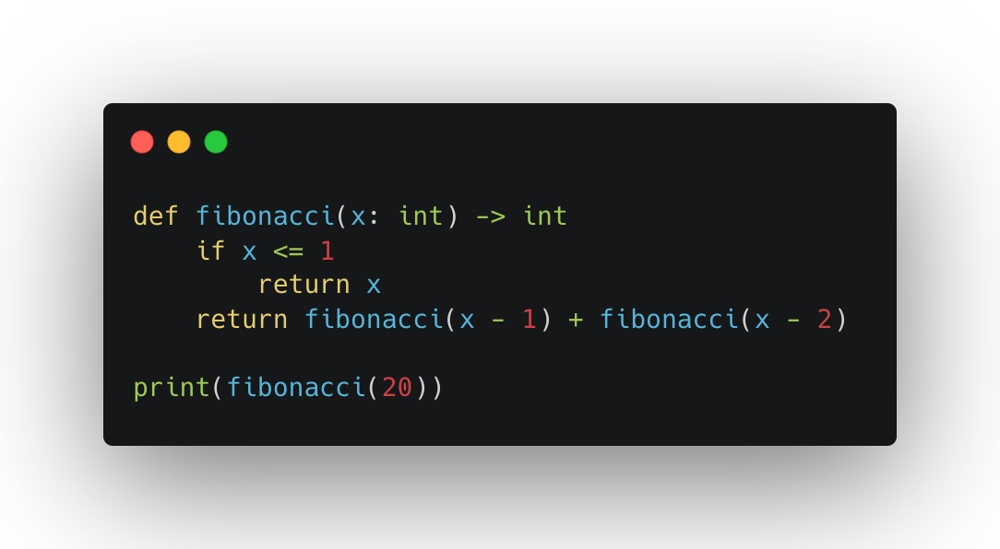
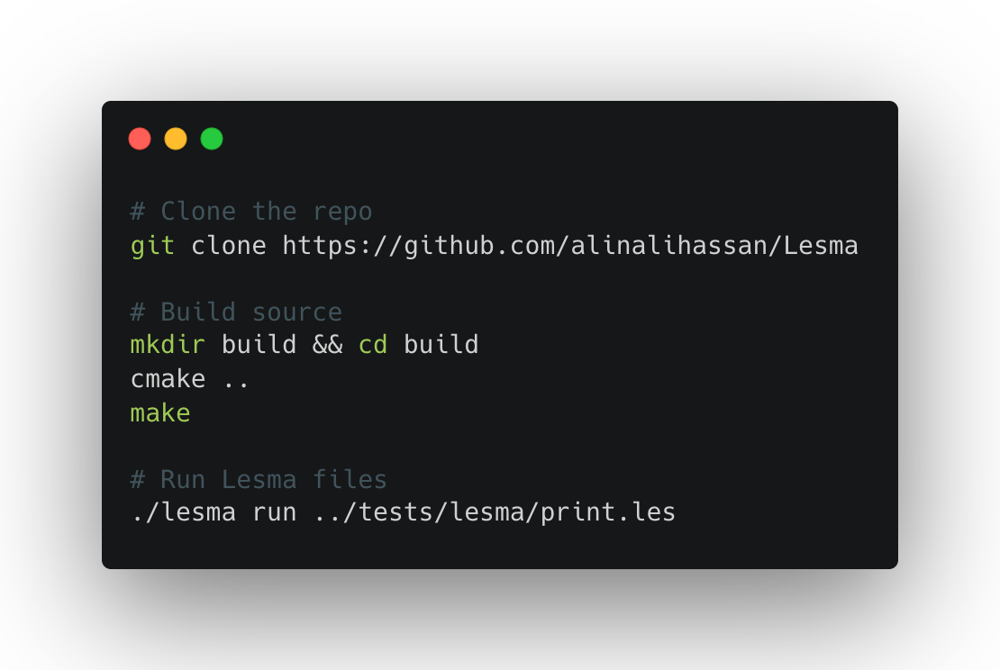

<h1 align="center">
  
  <br>
  Lesma
</h1>

<div align="center">

[](https://github.com/alinalihassan/Lesma/blob/main/LICENSE.txt)
[](https://github.com/alinalihassan/Lesma/releases)
[](https://github.com/alinalihassan/Lesma/releases)
[](https://github.com/alinalihassan/Lesma/actions/workflows/ci.yaml)

</div>

**Lesma** is a compiled, statically typed, imperative and object-oriented programming language with a focus on
expressiveness, elegance, and simplicity, while not sacrificing on performance.

## 📝 Features

- 🚀 Fast Compilation: compiling at a rate of ≈230k
  loc/s, [because waiting for code to compile is a thing of the past](https://xkcd.com/303/)
- ⚡ Blazing Fast Execution: because it should be, it's as fast as C, using LLVM's state-of-the-art optimizations, but it
  won't ever oblige you to make an extra effort just for the sake of performance
- 🔬 Statically Typed: because IDE completion is like heaven, while unknown behaviour and runtime exceptions are like
  hell
- 🧑‍🎨 Simple: because the code should be easily readable, and it shouldn't make you guess what it does or take long to
  learn

## ✍️ Example



## 📖 Documentation

- [Official Documentation](https://lesma-lang.com/)
- [Examples](https://github.com/alinalihassan/Lesma/blob/main/tests/lesma)

## Installation

Every lesma release contains archives with the binary and standard library which you can grab,
but you could also use the installer script to do all the work for you. Paste the following in your terminal:

```bash
bash -c "$(curl -fsSL https://raw.githubusercontent.com/alinalihassan/Lesma/main/scripts/get-lesma.sh)"
```

## 🔧 Build

In order to build Lesma, you need Clang and LLVM 15 installed. It's currently only supported on Linux and macOS.
For a more comprehensive guide, and more information on how to install the prerequisites,
read the documentation on [Getting Started](https://lesma-lang.com/docs/introduction/getting-started)



## 💬 Contributing

Pull requests are welcome. For major changes, please open an issue to discuss your proposal and what you'd like to
change.

- To keep updated with releases, consider starring the project.
- Check the [code of conduct](CODE_OF_CONDUCT.md) and [contributing guidelines](CONTRIBUTING.md)

## 📎 License

This software is licensed under the [MIT](https://github.com/alinalihassan/Lesma/blob/main/LICENSE.txt)
© [Alin Ali Hassan](https://github.com/alinalihassan).